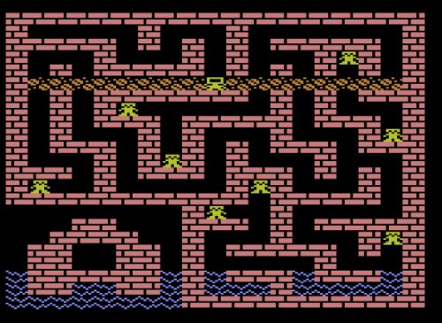

Floody Bot game in Turbo BASIC XL for Atari 8-bit. Entry for 2019 10-line BASIC contest

I love the BASIC 10-Liner contest! I didn’t find the time/energy/whatever to enter in 2018, so am excited to write some short BASIC programs for this year’s contest. First out of the gate is Floody Bot. This will be an entry for the EXTREME-256 category.

My soft overarching theme for entries this year is classic BASIC algorithms. Floody Bot started with the kernel of [Maze Generator by Charles Bond](https://archive.org/details/1981-12-compute-magazine/page/n55/mode/2up), which was published in Compute! Magazine Issue 19.

In this game, you play the part of a rescue bot entrusted to save humans from rising flood waters. Touch a human to save them. You must rescue three or more humans to proceed to the next level. As levels increase, the flood waters rise more quickly. Oh, the bot can’t swim.

Once per level, you can press the fire button to set off a bomb destroying everything in your horizontal row. This can get you out a sticky situation. If your bot gets stuck, press START to self-destruct. (If you’ve already rescued three or more humans, you’ll move on to the next level with a new bot.)

Earn points for rescuing humans (lower-down humans are worth more.) Lose a lot of points if your bomb kills a human. (You don’t lose points if flood waters kill a human.)
